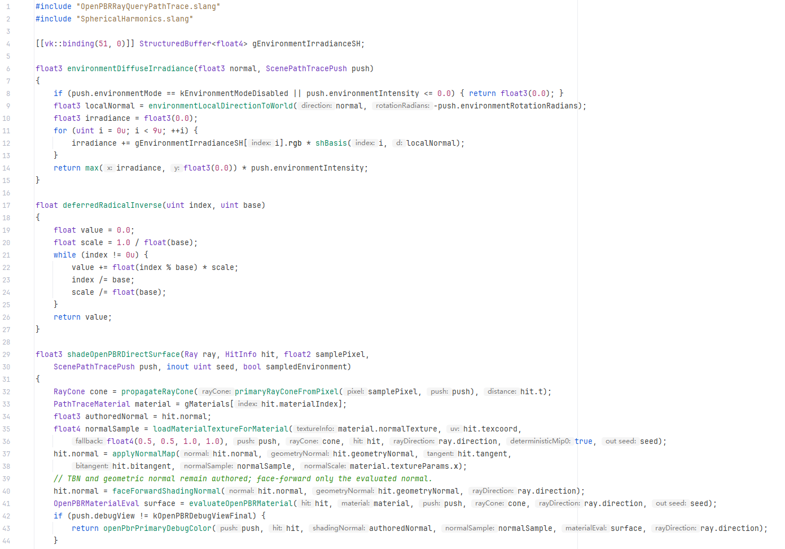
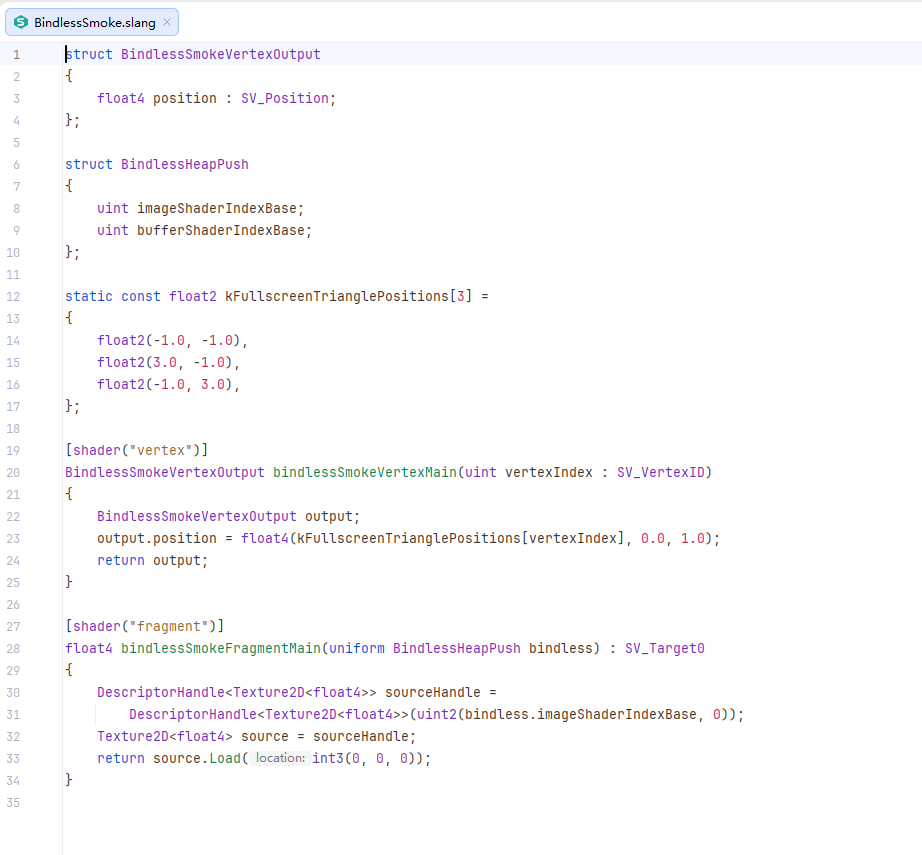
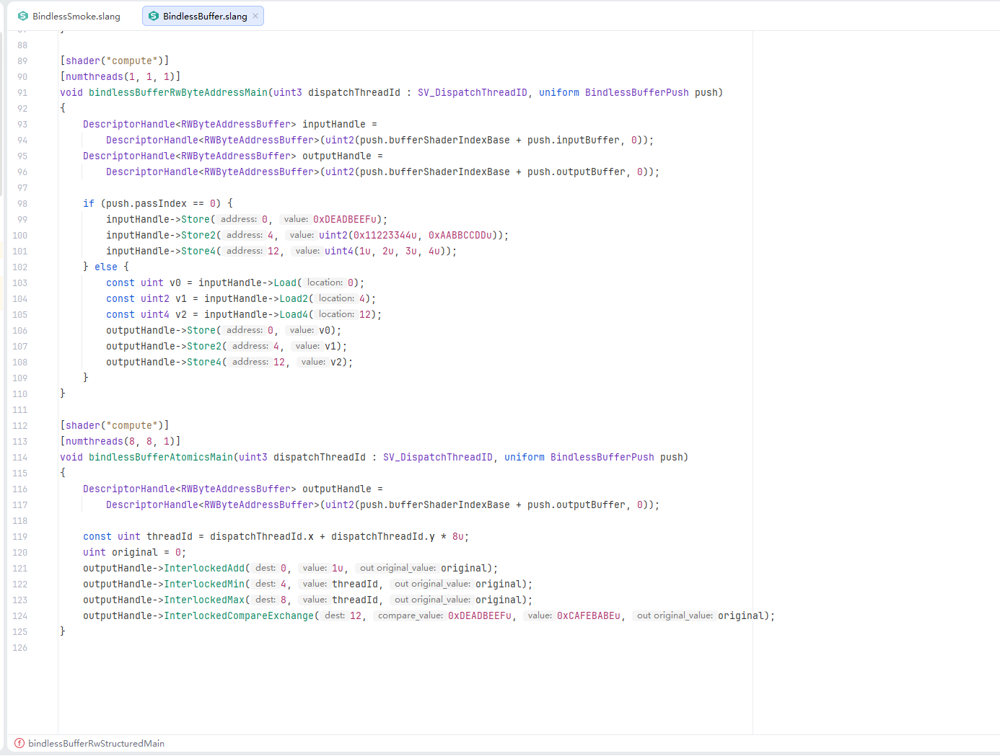

# Slang Language Support for CLion

English | [简体中文](README.zh-CN.md)

A CLion plugin for C++/CMake projects that use Slang. It connects CLion's native LSP client to the
bundled enhanced `slangd` (Windows x64) or an external official server while retaining lightweight lexical highlighting that does not depend on
an external process.

## Showcase

Slang editing in CLion, from path-tracing code to bindless shaders. Colors follow the active editor
scheme; semantic highlighting and inlay hints depend on the configured `slangd` and IDE settings.

### Path tracing and inlay hints

Distinct include paths, resource types, functions and comments, with inline parameter hints in
path-tracing code.



### Bindless vertex and fragment shaders

Shader entry-point attributes, HLSL semantics and nested generic texture handles in one editor view.



### Buffer operations and atomics

Compute shader resource handles, byte-address buffer reads/writes and atomic operations with
inline argument names.



## Features

- [Bundled or external slangd](docs/bundled-slangd.md), with automatic restart when switching sources
- Hover signature syntax highlighting using the active Slang color scheme (including stock slangd)
- [Type alias hover details](docs/type-hover.md): vector/matrix expansion, element types and dimensions,
  with built-in/user alias distinction; included in bundled slangd (patch 0006)
- [Module syntax highlighting](docs/module-highlighting.md): module/import/implementing names, `__include` paths,
  and dotted namespace declarations/usings, including without a running language server
- [Field hover details](docs/field-hover.md): Rider-style declaration and owner, natural size/alignment/offset,
  and compact definition links; included in bundled slangd (patch 0008)
- [Struct hover details](docs/struct-hover.md): namespaces, natural size/alignment/padding and compact
  definition links at parameter type references; included in bundled slangd (patch 0007)
- [Slang Rider Light](docs/rider-light-color-scheme.md): a light preset mapped from Rider's exported C++ colors,
  also used as Slang defaults in Light / IntelliJ Light; preserves custom colors and dark themes
- `.slang` and `.slangh` file types and icons
- Lexical highlighting for common Slang/HLSL keywords, built-in types, attributes, semantics,
  preprocessor directives, strings, numbers, and comments
- Semantic coloring through `slangd` Semantic Tokens, including the stock type, namespace,
  variable, parameter, property, function, and macro categories, plus struct, interface, enum,
  type parameter, method, decorator, and standard modifiers
- Line and block comments, brace matching, quote pairing, and a dedicated color settings page for
  lexical and semantic roles
- A project-wide `slangd` client built on the JetBrains Native LSP API
- Optional [preprocessor branch display](docs/preprocessor-branch-display.md): inactive-code dimming,
  active-branch marks and branch source labels, included in bundled slangd
- Optional [M4c context selector](docs/preprocessor-contexts.md): discover direct/transitive includers,
  search/select a compilation root, and remember the choice per file; included in bundled slangd
- Optional [M4e Shader Variants](docs/shader-variants.md): saved build contexts with per-variant macros,
  include paths and target/profile, plus an explicit CMake exporter; included in bundled slangd
- Optional [M4d branch preview](docs/branch-preview.md): temporarily define/undefine macros on the selected
  root or Variant, with explicit Stop and automatic cleanup on close/context switch; included in bundled slangd
- [Structured buffer and generic argument colors](docs/structured-buffer-highlighting.md): separate
  `StructuredBuffer`/`RWStructuredBuffer` family and checked type-argument colors; included in bundled slangd (patch 0005)
- Standard Diagnostics, Completion, Hover, Signature Help, Definition, References, Semantic
  Tokens, Inlay Hints, and Formatting capabilities, depending on the selected `slangd`
- Definition navigation through Ctrl+Click, Ctrl+B, and Ctrl+Hover. The plugin reuses the active
  `slangd` session to work around CLion 2026.1 Native LSP not issuing Definition requests on the
  Ctrl+mouse path, and accepts servers that return a single definition as a `Location` instead of
  the standard array form
- External `slangd`: manual project path or automatic discovery via `SLANGD_PATH`, `VULKAN_SDK`, `PATH`
- `workspace/configuration` mapping for `slangdconfig.json`, including `${workspaceFolder}`
  expansion
- Navigation to `slang-synth://<module>` built-in modules, generated and cached through
  `slangd --print-builtin-module <module>`

The plugin builds only a flat PSI from lexical tokens to provide precise ranges for editor actions.
It deliberately does not implement a second Slang semantic parser. Semantic truth remains with the
Slang compiler front end, avoiding divergence as the language evolves.

## Compatibility

- Build baseline: CLion 2026.1.3 (Build 261.25134)
- Minimum version: CLion 2026.1.3. The plugin uses compatibility APIs retained in 2026.2 and does
  not set an artificial `until-build`
- Plugin Verifier 1.410: Compatible with CLion 2026.1.5 (261.27258.50) and 2026.2.1 (262.9437.136)
- Build JDK: 25, producing `--release 21` bytecode; the Gradle Wrapper uses Gradle 9.0.0
- Bundled enhanced slangd supports Windows x64; other platforms require an external server

The project uses the pre-2026.1.4 Native LSP type names as its compatibility entry point.
JetBrains renamed these APIs in 2026.1.4 but retained the old types for existing plugins.

## Installation and usage

1. Use the release ZIP, which includes enhanced slangd for Windows x64. To use your SDK instead,
   choose **External / official slangd** in Slang settings.
2. To build from source, first [build and stage bundled slangd](docs/bundled-slangd.md), then build the plugin:

   ```powershell
   .\gradlew.bat clean test buildPlugin
   ```

   If the system Java is too old, use the JBR bundled with an installed CLion:

   ```powershell
   .\scripts\build-with-clion-jbr.ps1 -ClionHome 'D:\Path\To\CLion' -Tasks clean,test,buildPlugin
   ```

   `ClionHome` only selects the JBR used to launch Gradle. Pass
   `-IdeSdkHome 'D:\Path\To\CLion'` only when you explicitly want that local IDE to serve as the
   compilation SDK. Release builds remain pinned to the CLion 2026.1.3 baseline in
   `gradle.properties` by default.

3. In CLion, open **Settings | Plugins | ⚙ | Install Plugin from Disk...** and select the generated
   ZIP under `build/distributions/`.
4. Under **Settings | Languages & Frameworks | Slang**, select **Bundled enhanced slangd (Windows x64)**
   or **External / official slangd**. Apply restarts the server; the resolved path is shown below.
   Existing manual configurations stay external on upgrade; automatic configurations default to bundled on Windows x64.
5. Open a `.slang` or `.slangh` file. The Language Services status bar shows the `slangd` status.

Semantic colors can be configured independently under
**Settings | Editor | Color Scheme | Slang | Semantic**. If the server is unavailable, the plugin
retains the basic colors produced by its local lexer. A stock `slangd` exposes its existing ten
categories; more detailed categories and modifiers are used automatically when an enhanced server
publishes them.

For the Rider-inspired Slang palette, keep **Light** or **IntelliJ Light** under **Settings | Editor |
Color Scheme**, then customize the **Slang** section. Only Slang attributes are added; C++ and editor
colors are unchanged. Version 0.7.2 removes the standalone **Slang Rider Light** scheme to avoid a
startup parent-resolution error. Existing custom schemes are not rewritten; switch old preset users
back to Light. See [migration instructions](docs/rider-light-color-scheme.md).

For local development, you can avoid downloading another CLion SDK:

```powershell
.\gradlew.bat -PlocalIdePath='D:\Path\To\CLion' test buildPlugin
```

## Project configuration

Place `slangdconfig.json` in the project root or a parent directory of the source file. Its keys
match the official Slang editor extension, for example:

```json
{
  "slang.predefinedMacros": ["VULKAN=1", "USE_BINDLESS=1"],
  "slang.additionalSearchPaths": [
    "${workspaceFolder}/Shaders",
    "${workspaceFolder}/Shaders/Lib"
  ],
  "slang.searchInAllWorkspaceDirectories": true,
  "slang.workspaceFlavor": "standard",
  "slang.inlayHints.deducedTypes": true,
  "slang.inlayHints.parameterNames": true
}
```

Copy and adapt the repository's `slangdconfig.example.json` as needed.

## Verification

```powershell
.\gradlew.bat test
.\gradlew.bat verifyPluginProjectConfiguration
.\gradlew.bat buildPlugin
.\gradlew.bat verifyPlugin
slangc -no-codegen .\src\test\testData\slang\Basic.slang
.\scripts\slangd-lsp-smoke.ps1
```

`slangd-lsp-smoke.ps1` opens the repository's definition fixture and asserts that the call site
resolves to the exact declaration of `twice`. It also opens the semantic-highlighting corpus,
invokes `textDocument/semanticTokens/full`, decodes the relative five-tuples, and validates UTF-16
ranges, the legend, and the token contract rather than merely checking whether the server advertises
the capability. The current official server uses the default `stock` contract; for an enhanced
server, use:

```powershell
.\scripts\slangd-lsp-smoke.ps1 -SemanticContract enhanced -AsJson
```

The JSON output records the resolved `slangd` path, executable SHA-256, `serverInfo`, complete
legend, and decoded tokens, making it suitable for CI comparison artifacts. See
[docs/semantic-token-protocol.md](docs/semantic-token-protocol.md) for the protocol contract and
evolution rules.

Launch CLion in the development sandbox:

```powershell
.\gradlew.bat runIde
```

## Current limitations

- The plugin does not claim `.hlsl` or `.hlsli` by default, avoiding conflicts with current or
  future CLion HLSL support.
- There is no full PSI, so deep IntelliJ language features such as local structural refactoring
  depend on the capabilities exposed through LSP.
- Bundled `slangd` currently supports Windows x64 only. Compile, Reflection, and Playground tool
  windows are not yet implemented.
- The first generation of a large built-in `slang-synth` module may introduce noticeable latency;
  later accesses use the cache.

See [docs/architecture.md](docs/architecture.md) for the architecture and roadmap.

## References

- [Official Slang VS Code extension](https://github.com/shader-slang/slang-vscode-extension)
- [Slang documentation](https://docs.shader-slang.org/)
- [JetBrains Native LSP API](https://plugins.jetbrains.com/docs/intellij/language-server-protocol.html)
